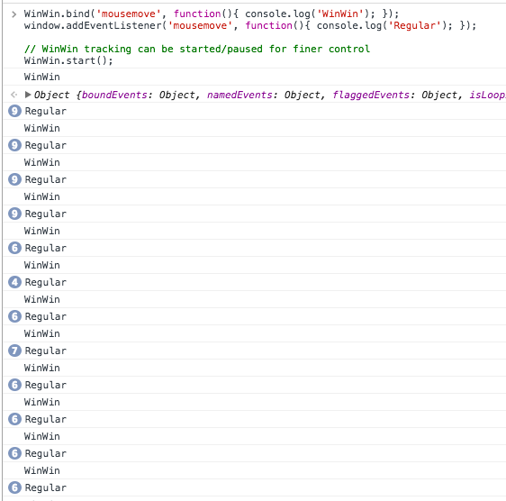

# winwin
## rAF-based window event manager

Simple module to bind events to the Window, while throttling via requestAnimationFrame. Instead of defining a millisecond-based throttle, events only fire on animation frames, when the browser is ready. Simple concept, effective results.

## Usage

Include `winwin.js` or `winwin.min.js` on the page, or if you've got bower, `bower install andymikulski/winwin`.

Here's a quick example of how to use WinWin:

```
WinWin.bind('mousemove', function(){ console.log('WinWin'); });
window.addEventListener('mousemove', function(){ console.log('Regular'); });

// WinWin tracking can be started/paused for finer control
WinWin.start();
```

And the results:



As you can see, the native window handler fires off a lot more than our rAF-throttled version.

## Named Bindings

Named bindings offer a convenient way to remove

```
WinWin.bind('mousemove', myHandler, 'move-handler');
WinWin.bind('mousemove', myHandler, 'other-handler');
```

.. later ..

```
WinWin.unbind('move-handler');
// `other-handler` is still goin
```


## Unbinding Events


Unbind a named event

```
WinWin.unbind('your-named-event');
```

Unbind all events of a certain type

```
WinWin.unbind('mousemove');
```

Unbind all events (named + unnamed)

```
WinWin.unbind();
// -or-
WinWin.unbindAll();
```


## Tracking

You can control when WinWin listens for events! Woah!

```
WinWin.start();
WinWin.stop();
WinWin.pause();
WinWin.resume();
```

===


### Credits

Developed by [Andy Mikulski](http://www.andymikulski.com/).